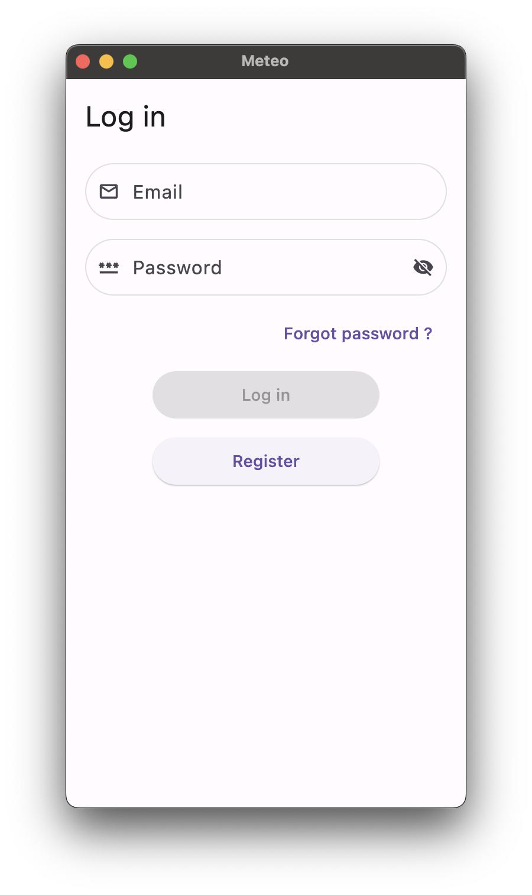
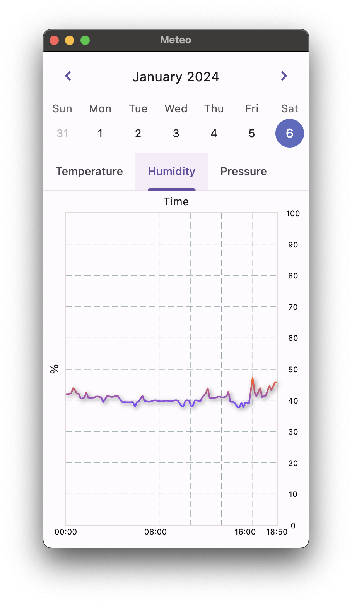
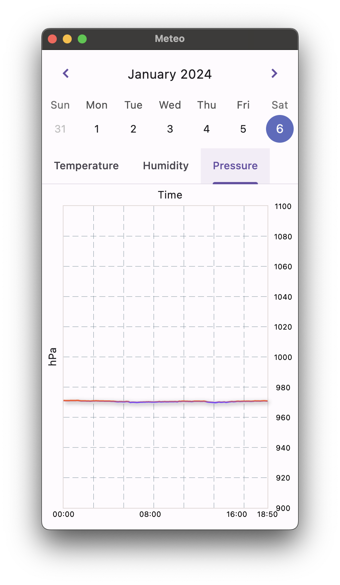

# Pico Meteo Client

Client for [Pico Meteo project](https://github.com/pro100andrey/pico_meteo).

## Modules UML


## Dotenv

Create `.env` file in `app` directory with next content:

```dotenv
BASE_URL="your_pocket_base_url"
```

## Screenshots
</img>
</img>
</img>

